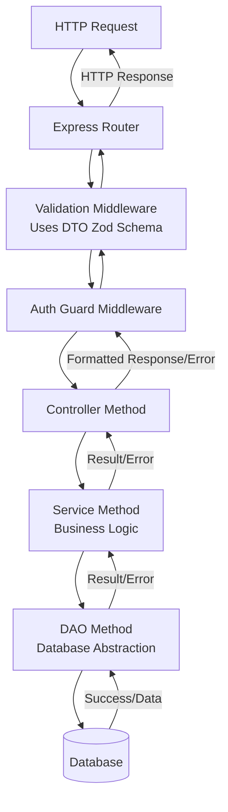

# Q-Core

An opinionated, Typescript-first meta-framework built on Express.js and Zod. The primary goal is to enforce a clean, scalable, and strongly typed architecture for backend APIs by providing a structured layered pattern and abstracting away common boilerplates.

## Getting Started

*   **Looking to contribute?** Please start by reading our [Contributor Guidelines](CONTRIBUTING.md) and [Code of Conduct](CODE_OF_CONDUCT.md).
*   **This project is licensed under the GNU General Public License v3.0.** See the [LICENSE](LICENSE) file for full details.

## Core Features

-   **Strict Type Safety**: Utilizes **Zod** schemas as the single source of truth for data shapes. This type safety propagates from the database layer (DTO/DAO) through the business logic (Service) and up to the HTTP layer (Controller), ensuring end-to-end validation and autocompletion.
-   **Opinionated Layer Architecture**: Mandates a separation of concern through four primary layers:
    1.  **Data Transfer Object (DTO)**: Defines the data schema, validation rules and field mappings using **Zod**.
    2.  **Data Access Object (DAO)**: Provides a standardized, generic interface for all CRUD operations against a database. It is abstracted to allow for different ORMs / query builders (e.g., Prisma). See the [DAO Abstraction Guide](docs/DAO_ABSTRACTION.md) for details.
    3.  **Service**: Contains the core business logic. It consumes a DAO to perform data operations and applies business rules.
    4.  **Controller**: Handles HTTP-specific concerns. It receives requests, calls services, and returns responses. It is devoid of business logic.
-   **Dependency Injection via Constructor**: A simple yet effective form of dependency injection is used. Each layer receives its dependency (the layer below it) explicitly via its constructor. This makes dependencies clear, easy to mock for testing, and avoids magical global state. See the [Architecture Deep Dive](docs/ARCHITECTURE.md) for examples.
-   **Centralized and Structured Error Handling**: The framework implements a sophisticated error handling pipeline. All errors, from validation failures to database exceptions, are caught, normalized, formatted, and returned to the client in a consistent JSON structure. This simplifies debugging and provides a reliable API contract. See `src/middleware/errorHandler.ts`.
-   **Security First Defaults**: Includes built-in utilities for authentication (`authGuard`, `authUtils`) and rate limiting, encouraging secure practices from the start.

## Architectural Flow

A typical HTTP request flows as follows:

`HTTP Request -> Express Router -> Validation (DTO) -> Auth Guard -> Controller Method -> Service Method -> DAO Method -> Database`

The response or error then flows back through the same chain in reverse, being handled and formatted appropriately at each step.

## Documentation

For a comprehensive understanding of the framework, please explore the following resources:

*   **[Contributor Guidelines](CONTRIBUTING.md)** - Everything you need to know to start contributing, from setting up your environment to submitting a pull request.
*   **[Code of Conduct](CODE_OF_CONDUCT.md)** - The standards we uphold to ensure our community is welcoming and respectful.
*   **[Architecture Deep Dive](docs/ARCHITECTURE.md)** - A detailed explanation of the layered pattern, dependency injection, and how the pieces fit together.
*   **[DAO Abstraction Guide](docs/DAO_ABSTRACTION.md)** - Instructions for implementing and switching between different database drivers (e.g., Prisma, Drizzle, Kysely).
*   **Example Implementation** - Check the `examples/` directory for a fully functional implementation of a CRUD module (e.g., `User` or `Post`).

## Roadmap

For information on planned features, upcoming improvements, and the project's direction, please see our [Roadmap](docs/ROADMAP.md) document.

---

*We welcome contributions from the community! Please remember to follow our [Contributor Guidelines](CONTRIBUTING.md) and respect our [Code of Conduct](CODE_OF_CONDUCT.md).*
