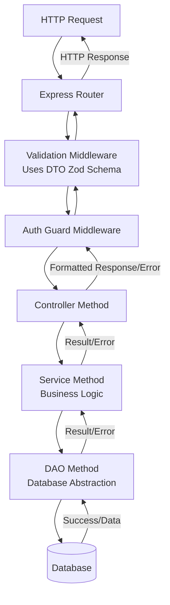

# Q-Core

An opinionated, Typescript-first meta-framework built on Express.js and Zod. The primary goal is to enforce a clean, scalable, and strongly typed architecture for backend APIs by providing a structured layered pattern and abstracting away common boilerplates.

> **Note:** The core library is database-agnostic. While it currently provides out-of-the-box support only for Prisma via `PrismaDAO` and `PrismaService`, you can easily extend it to work with any database or ORM by implementing the `BaseDAO` and `BaseDatabaseService` interface. Support for more ORMs is planned for future releases.

## Getting Started

*   **Looking to contribute?** Please start by reading our [Contributor Guidelines](CONTRIBUTING.md) and [Code of Conduct](CODE_OF_CONDUCT.md).
*   **This project is licensed under the GNU General Public License v3.0.** See the [LICENSE](LICENSE) file for full details.

## Quick Start

> **Prerequisite**: A working Prisma setup. This tutorial uses the provided `PrismaDAO` and `PrismaService` which requires @prisma/client and a configured database.

This example creates a fully-typed, production-ready CRUD API for a `User` resource. 

### 1. Installation
This library requires `express`, `zod` and `@prisma/client` to be installed in your project
```bash
npm install express zod @prisma/client
npm install @prjq/q-core
```

### 2. Define Your Data Schema (DTO)
Create `user.dto.ts`. This defines your data shape, validation, and common field mappings.
```typescript
import z from "zod";
import { BaseDTO } from "@prjq/q-core";

// Base Zod schema
const userSchema = z.object({
    id: z.uuid(),
    name: z.string().min(2),
    email: z.email(),
    password: z.string().min(8),
})

// user.dto.ts
class UserDTO extends BaseDTO {
    constructor() {
        super({
            baseSchema: userSchema,
            commonFields: {
                idField: "id",
            }
        })
    }
}

export { UserDTO, userSchema };
```

### 3. Create a Data Access Object (DAO)
Create `user.dao.ts`. This layer provides a generic, type-safe interface to your database.
```typescript
import { PrismaDAO } from "@prjq/q-core";
import { UserDTO } from "./user.dto";

// user.dao.ts
class UserDAO extends PrismaDAO<UserDTO> {
    constructor() {
        super({
            modelName: "user", // Must match your Prisma model name
            dto: new UserDTO()
        })
    }
}

export { UserDAO };
```

### 4. Implement Business Logic (Service)
Create `user.service.ts`. This layer encapsulates your business rules.
```typescript
import { BaseService } from "@prjq/q-core";
import { UserDAO } from "./user.dao";

// user.service.ts
class UserService extends BaseService<UserDAO> {
    constructor() {
        super({
            dao: new UserDAO()
        })
    }
    // Add any custom business logic methods here
    // async customMethod() { ... }
}

export { UserService };
```

### 5. Create an HTTP Controller
Create `user.controller.ts`. This layer handles HTTP requests and responses.
```typescript
import { BaseController } from "@prjq/q-core";
import { UserService } from "./user.service";

// user.controller.ts
class UserController extends BaseController<UserService> {
    constructor() {
        super({
            service: new UserService()
        })
    }
    // Override or add custom controller methods here
    // async customRouteHandler(req: Request, res: Response) { ... }
}

export { UserController };
```

### 6. Set Up the Router
Create `user.router.ts`. This wires the controller methods to Express routes.
```typescript
import { Router } from "express";
import { UserController } from "./user.controller";

// Instantiate the controller
const userController = new UserController();

// Create the router
const userRouter = Router();

// Map CRUD operations to routes. All validation, error handling, and typing are automatic.
userRouter.get("/", userController.getAll); // GET /users
userRouter.get("/:id", userController.getById); // GET /users/:id
userRouter.post("/", userController.post); // POST /users
userRouter.put("/:id", userController.update); // PUT /users/:id
userRouter.delete("/:id", userController.delete); // DELETE /users/:id

// Add custom routes if needed
// userRouter.patch("/:id/profile", userController.customRouteHandler);

export { userRouter };
```

### 7. Import the Router into Your App
In your main application file (e.g., `src/app.ts`):
```typescript
import express from 'express';
import PrismaClient from "@prisma/client";
import { ExpressServer, PrismaService } from "@prjq/q-core";
import { userRouter } from './user/user.router'; // Import your router

const app = express();
app.use(express.json());


// Use your auto-generated, typed router
app.use('/users', userRouter);

// Initialize application with database
const prisma = new PrismaClient()
const db = PrismaService.init(prisma)

const server = new ExpressServer(app, db)
server.start(3000)
```

### 8. Run Your API
```bash
npm run dev
```
Your complete, validated, secure, and typed User API is now running! All endpoints (`GET /users`, `POST /users`, etc.) come with built-in validation, error handling, and soft delete functionality out of the box.

**Next Steps:** Explore the `examples/` directory for more complex use cases and check the [Architecture Deep Dive](docs/ARCHITECTURE.md) to understand the magic behind the abstractions.

---

## Core Features

-   **Strict Type Safety**: Utilizes **Zod** schemas as the single source of truth for data shapes. This type safety propagates from the database layer (DTO/DAO) through the business logic (Service) and up to the HTTP layer (Controller), ensuring end-to-end validation and autocompletion.
-   **Opinionated Layer Architecture**: Mandates a separation of concern through four primary layers:
    1.  **Data Transfer Object (DTO)**: Defines the data schema, validation rules and field mappings using **Zod**.
    2.  **Data Access Object (DAO)**: Provides a standardized, generic interface for all CRUD operations against a database. It is abstracted to allow for different ORMs / query builders (e.g., Prisma). See the [DAO Abstraction Guide](docs/DAO_ABSTRACTION.md) for details.
    3.  **Service**: Contains the core business logic. It consumes a DAO to perform data operations and applies business rules.
    4.  **Controller**: Handles HTTP-specific concerns. It receives requests, calls services, and returns responses. It is devoid of business logic.
-   **Dependency Injection via Constructor**: A simple yet effective form of dependency injection is used. Each layer receives its dependency (the layer below it) explicitly via its constructor. This makes dependencies clear, easy to mock for testing, and avoids magical global state. See the [Architecture Deep Dive](docs/ARCHITECTURE.md) for examples.
-   **Centralized and Structured Error Handling**: The framework implements a sophisticated error handling pipeline. All errors, from validation failures to database exceptions, are caught, normalized, formatted, and returned to the client in a consistent JSON structure. This simplifies debugging and provides a reliable API contract. See `src/middleware/errorHandler.ts`.
-   **Security First Defaults**: Includes built-in utilities for authentication (`authGuard`, `authUtils`) and rate limiting, encouraging secure practices from the start.

## Architectural Flow

A typical HTTP request flows as follows:

`HTTP Request -> Express Router -> Validation (DTO) -> Auth Guard -> Controller Method -> Service Method -> DAO Method -> Database`

The response or error then flows back through the same chain in reverse, being handled and formatted appropriately at each step.



## Documentation

For a comprehensive understanding of the framework, please explore the following resources:

*   **[Contributor Guidelines](CONTRIBUTING.md)** - Everything you need to know to start contributing, from setting up your environment to submitting a pull request.
*   **[Code of Conduct](CODE_OF_CONDUCT.md)** - The standards we uphold to ensure our community is welcoming and respectful.
*   **[Architecture Deep Dive](docs/ARCHITECTURE.md)** - A detailed explanation of the layered pattern, dependency injection, and how the pieces fit together.
*   **[DAO Abstraction Guide](docs/DAO_ABSTRACTION.md)** - Instructions for implementing and switching between different database drivers (e.g., Prisma, Drizzle, Kysely).
*   **Example Implementation** - Check the `examples/` directory for a fully functional implementation of a CRUD module (e.g., `User` or `Post`).

## Roadmap

For information on planned features, upcoming improvements, and the project's direction, please see our [Roadmap](docs/ROADMAP.md) document.

---

*We welcome contributions from the community! Please remember to follow our [Contributor Guidelines](CONTRIBUTING.md) and respect our [Code of Conduct](CODE_OF_CONDUCT.md).*
